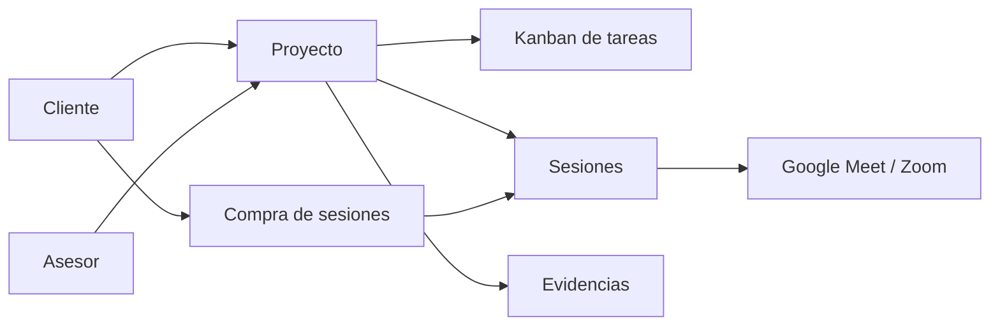

# Hazlo tu mismo

Plataforma para conectar a un cliente con un asesor especializado en desarrollo no code e IA, trabajar juntos sobre un proyecto digital, comprar sesiones de trabajo y dejar trazabilidad del avance mediante tareas, evidencias y sesiones realizadas.

## Propuesta base

### Problema

Hoy muchas personas quieren construir soluciones digitales con no code e IA, pero el proceso suele ocurrir entre chats, videollamadas sueltas, pagos manuales y documentos dispersos. Eso dificulta vender, ejecutar, hacer seguimiento y demostrar resultados.

### Solucion

Hazlo tu mismo centraliza:

- La gestion de proyectos entre cliente y asesor.
- Un tablero de tareas tipo Kanban por proyecto.
- La compra y administracion de sesiones de trabajo.
- La programacion de videollamadas integradas.
- La evidencia del avance por tarea y por sesion.

### Usuarios principales

- Cliente: compra sesiones, participa en el proyecto y valida avances.
- Asesor: lidera la ejecucion, gestiona tareas, evidencia y sesiones.
- Administrador: supervisa operaciones, pagos e incidencias.

## Alcance MVP

El MVP debe resolver el flujo principal de punta a punta:

1. El cliente entra a la plataforma.
2. Se crea o activa un proyecto.
3. El cliente compra un paquete de sesiones.
4. Cliente y asesor programan una sesion.
5. La sesion se realiza por videollamada.
6. El asesor deja tareas, evidencia y entregables.
7. El cliente revisa el avance del proyecto en un solo lugar.

### Modulos MVP

- Autenticacion y roles.
- Proyectos y workspace compartido.
- Kanban de tareas por proyecto.
- Compra de sesiones.
- Agenda y sesiones de trabajo.
- Evidencias y comentarios por tarea.
- Panel simple de administracion.

## Recomendacion tecnica

### Stack sugerido

- Frontend: Next.js + TypeScript.
- UI: Tailwind CSS.
- Base de datos: Neon Postgres.
- ORM y migraciones: Drizzle.
- Auth sugerido para siguiente fase: Clerk o Auth.js.
- Pagos: Stripe.
- Videollamadas MVP: Google Meet via Google Calendar.
- Videollamadas fase 2: Zoom.
- Hosting: Vercel.

### Por que esta combinacion

- Permite lanzar rapido sin construir demasiada infraestructura propia.
- Neon y Drizzle encajan bien con entidades relacionales como proyectos, tareas, sesiones y evidencias.
- Stripe simplifica paquetes de sesiones y conciliacion de pagos.
- Google Meet por Calendar reduce friccion tecnica para el MVP.

## Arquitectura funcional



## Entidades principales

- `users`
- `profiles`
- `projects`
- `project_members`
- `boards`
- `tasks`
- `task_evidence`
- `session_packages`
- `purchases`
- `sessions`
- `session_notes`
- `payments`

## Decisiones iniciales

- El MVP tendra un solo asesor principal por proyecto.
- La videollamada prioritaria sera Google Meet en la primera version.
- Las sesiones se venderan por paquetes, no por bolsa libre de tiempo.
- La evidencia se asociara a tareas y sesiones.
- Cada proyecto tendra un tablero Kanban base: `Pendiente`, `En progreso`, `En revision`, `Completado`.

## Roadmap resumido

- Fase 0: definicion de producto, datos y arquitectura.
- Fase 1: autenticacion, proyectos y tablero Kanban.
- Fase 2: pagos, compra y reserva de sesiones.
- Fase 3: evidencias, notas de sesion y panel administrativo.
- Fase 4: automatizaciones, metricas y mejoras operativas.

## Documentacion inicial

- [PRD base](./docs/PRD.md)
- [Backlog inicial](./docs/BACKLOG.md)
- [Roadmap MVP](./docs/ROADMAP.md)

## Siguiente paso recomendado

Construir primero el flujo critico del negocio:

`registro -> proyecto -> compra de sesiones -> reserva -> videollamada -> evidencia -> seguimiento`

## Arranque tecnico

```bash
npm install
npm run dev
```

La app inicial queda servida en `http://localhost:3000`.

## Scripts utiles

```bash
npm run db:generate
npm run db:push
npm run db:seed
```

## Base de datos con Neon

1. Define `DATABASE_URL` en Vercel y en tu entorno local.
2. Genera o actualiza migraciones con `npm run db:generate`.
3. Aplica el esquema a Neon con `npm run db:push`.
4. Verifica la conexion con `GET /api/health/db`.

Puedes usar [`.env.example`](./.env.example) como referencia para las variables.
